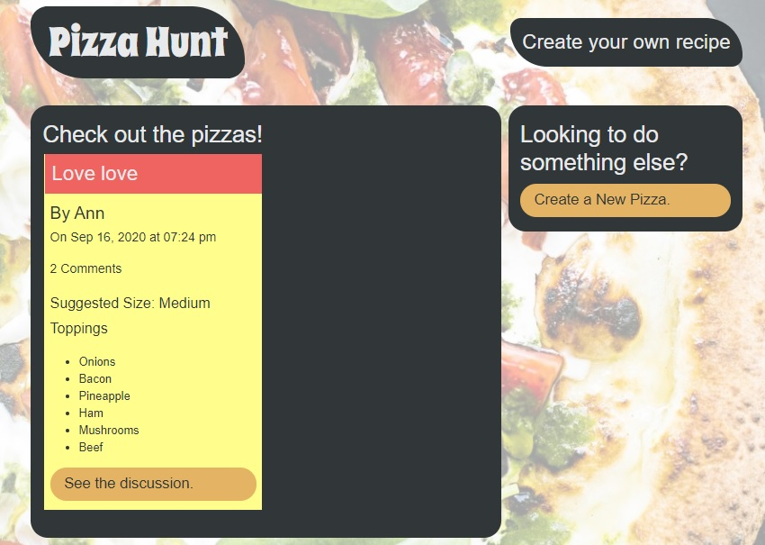
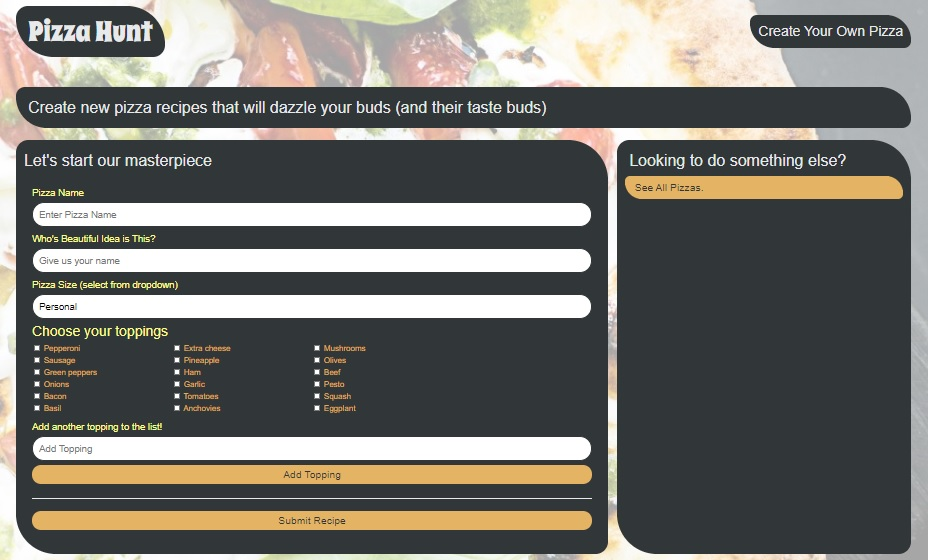
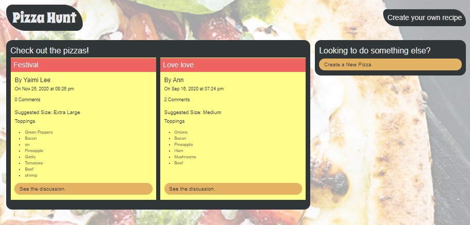
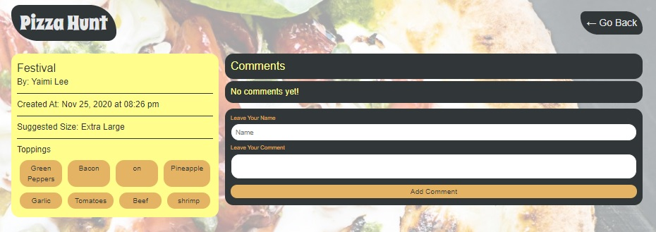

# PIZZA HUNT

  

# Description

Pizza Hunt is an application that allows users to connect with each other based on their love of pizza. At Pizza Hunt, users can share and discuss the pizza topping combinations of their dreams.

   
 _____________________________________________________________________
 Visit the site! [Pizza Hunt](https://tranquil-refuge-93011.herokuapp.com/)

# Table of Contents

[Installation](#Installation)

[Usage](#Usage)

[License](#License)

[Technologies](#Technologies)

[Questions](#Questions)

  
# Installation 
 - Clone the app in to your pc.
- Open a console terminal for the app from the file server.js.
- Run the line command `npm install` and then `npm start`.
- Open the browser and type in the address bar `http: // localhost: 3001 /`

# Usage 
 -  The user has several options to choose from to interact with the application, such as:

> - The user can create pizzas by clicking on the button `Create a New Pizza` and the following page is shown below; he will give a name to his pizza, provide his name or nickname and select the ingredients that his pizza and you have the option to add another topping to the list by clicking on the `Add Topping` button. Finally you will click on` Submit Recipe` to create your pizza.

 

The user can see all the pizzas that have been created, as well as discuss with other users about a certain pizza by clicking on the `See the discussion` button to add a comment.

Image show all pizzas.

Image for the user see the discussion and add a comment.

 

# License
The license for which the application is covered:
NONE 

# Technologies 
 - NODE
 - EXPRESS
 - JAVASCRIPT
 - MONGODB
 - MONGOOSE
 - MOMENT
 - HEROKU

# Questions

  If you have questions about the project, below you can find ways to answer them, either by visiting my highub or contacting me by email
  
  Link to my Github: [anniavd](https://github.com/anniavd)

  
  Email acount: [annia.valdesd@gmail.com](mailto:annia.valdesd@gmail.com)
    
